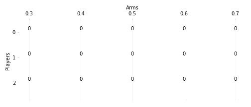
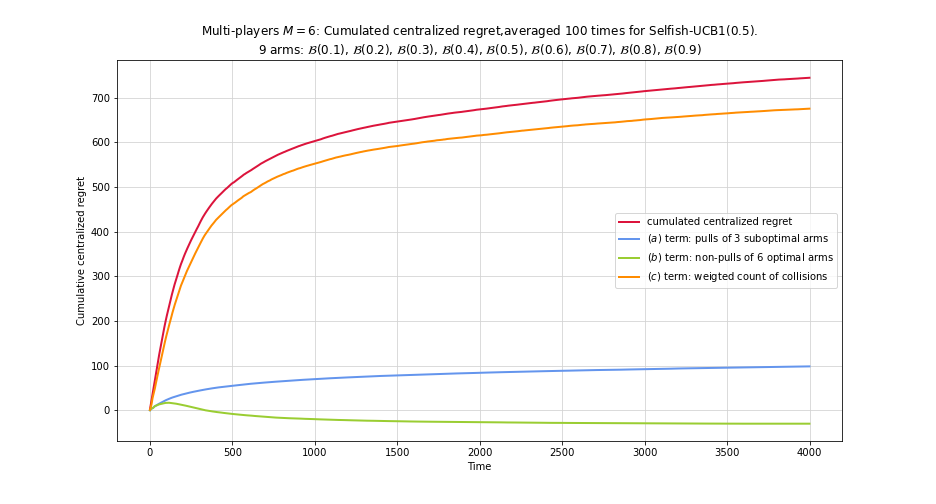
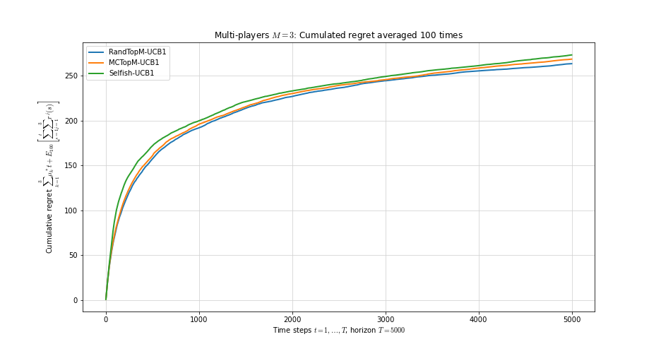

# Multi-Player Multi-armed Bandit
Implementation of the algorithms introduced in "Multi-Player Bandits Revisited" [1]. This project was done as part of "[Sequential Decision Making](http://chercheurs.lille.inria.fr/ekaufman/SDM.html)" course taught by Émilie Kaufmann.

**Warning –** This "toy"-repository does not intend to collect the state-of-the-art multi-player multi-armed bandits (MAB) algorithms! We highly recommend you to take a look at the [SMPyBandits](https://github.com/SMPyBandits/SMPyBandits) library if you want to play in a larger sandbox!

The strategies currently implemented are:
 * `RandTopM`
 * `MCTopM`
 * `Selfish`


## Installation
Simply clone the project
```
git clone https://github.com/JulienNonin/multiplayer-bandits
cd multiplayer-bandits
```
The project runs on Python 3.6+ and only require NumPy and Matplotlib.

## How-To
```python
import matplotlib.pyplot as plt
import src as mpmab

# Define a MAB bandit environment
bandit = mpmab.BernoulliMAB([0.3, 0.4, 0.5, 0.6, 0.8])
nb_arms = bandit.nb_arms

# Define a strategy with nb_players players
nb_players = 3
strategy = mpmab.strategy(mpmab.PlayerRandTop, bandit.nb_arms, nb_players, policy=mpmab.UCB1Policy(0.5))

# Run the strategy on the bandit environment
my_experiment = mpmab.MultiplayerExp(bandit, strategy, time_horizon=200).run()
my_experiment.rewards  # Rewards history
```

In `tutorial.ipynb` you can find a more complete presentation of the module and its usage. For example, you will be able to produce a nice animation of the history of selections and collisions, like this one below:



Some experiments are carried out in `multi-player-simulation.ipynb` to test the strategies on different problems, and reproduce some results of [1] (cf Section "Illustrations" for the impatient ones).


## A remark about `RandTopM` strategy
As "algorithmically" defined in the original paper [1], it seems that the `RandTopM` players do not change arm when a collision occurs, but only if the arm currently chosen becomes "sub-optimal". This seems to contradict what the authors state about this algorithm. You can find an implementation of the algorithms as originally stated under `PlayerRandTopOld`. This strategy suffers linear regret. Therefore our own interpretation of what the strategy should be, can be found in `PlayerRandTop`.

## Illustrations




## TODO
- [x] Propose a fix to the algorithm `RandTopM` as introduced in [1]
- [] Implement `RhoRand`
- [] Make the setting and display of experiences more user-friendly


## References
[1] L. Besson & É. Kaufmann, *Multi-Player Bandits Revisited*. In *Proc. of Algorithmic Learning Theory*, 2018. http://proceedings.mlr.press/v83/besson18a.html.